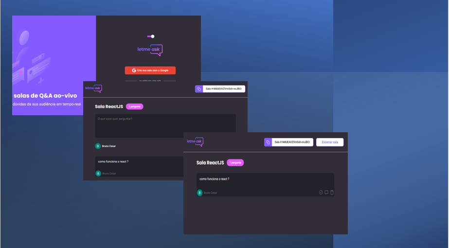

# Projeto Letmeask.


## Descrição do Projeto
<p>projeto de perguntas e respostas com authenticação com o firebase google desenvolvido no evento NLW da Rocketseat.</p>


<h4> 
	✅  Status: Concluído.
</h4>

<h2>Demonstração da aplicação</h2>

<div>
  
  
</div>


## Pré-requisitos

<p>
Antes de começar, você vai precisar ter instalado em sua máquina as seguintes ferramentas:
<strong>Git</strong> <a>https://git-scm.com</a>, <strong>Nodejs</strong> <a>https://nodejs.org/en/</a>, <strong>Yarn</strong>(opcional) <a>https://yarnpkg.com/</a> Alem disso para autenticação e necessario o firebase do google <strong>Firebase</strong><a>https://firebase.google.com/</a>. 
Além disto é bom ter um editor para trabalhar com o código como <strong>VSCode</strong> <a>https://code.visualstudio.com</a>
<p>

## 🎲 Rodando o Front end

```bash
# Clone este repositório
$ git clone <https://github.com/Bruno-Cesar123/letmeask>

#FRONT END

# Acesse a pasta do projeto no terminal/cmd
$ cd letmeask

# Instale as dependências
$ npm install ou yarn 

# Execute a aplicação em modo de desenvolvimento
$ npm start ou yarn start

# O servidor inciará na porta:3000 - acesse <http://localhost:3000>
```


## 🛠 Tecnologias 

<p>As seguintes ferramentas foram usadas na construção do projeto:</p>

<div>
  <ul>
    <li style="list-style: none"> <strong>Node.js</strong> <a>https://nodejs.org/en/</a></li>
    <li style="list-style: none"> <strong>React</strong> <a>https://pt-br.reactjs.org/</a></li>
    <li style="list-style: none"> <strong>Typescript</strong> <a>https://www.typescriptlang.org/</a></li>
    <li style="list-style: none"> <strong>Firebase</strong> <a>https://firebase.google.com/</a></li>
  </ul>
</div>

## 📝 Licença

<p>Este projeto esta sobe a licença MIT.</p>

<p>Feito por <strong>Bruno Cesar</strong> <a href="https://www.linkedin.com/in/bruno-cesar-b0039715a/">Linkedin</a>